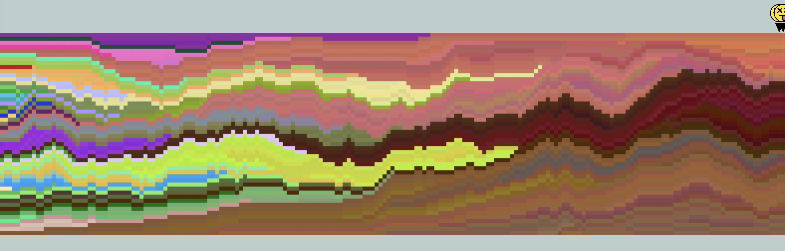
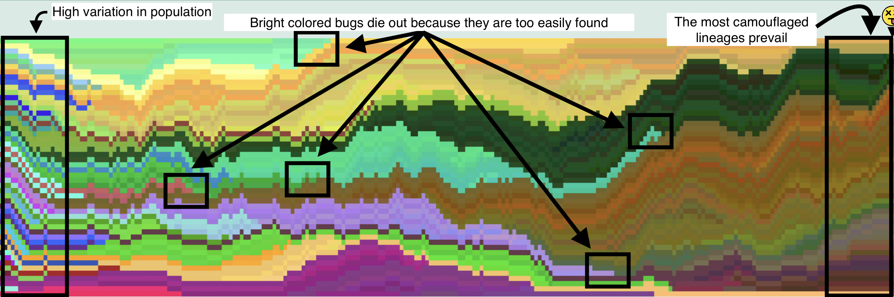

# Camouflage Evolution In Bugs

An interactive simulation for teaching/learning the basics of evolution by natural selection

## Live Site

🌐 **[View the live application at https://www.bug-evolution.com/](https://www.bug-evolution.com/)**

<div align="center" style="display:flex;flex-direction:column;gap:10px;">
  
  
    
</div>

## How to Run Locally

### Requirements

- **Node.js** >= 18
- **Bun** 1.0.2+

### Installation & Setup

1.  **Clone the repository**

```
git clone https://github.com/austinimperial/natural-selection-simulation.git
```

```
cd bug_hunt
```

2.  **Install dependencies**

```
bun setup
```

3.  **Run the development server**

```
bun dev
```

4.  **Open your browser**

Navigate to `http://localhost:3000` to view the application

## Tech Stack

         
